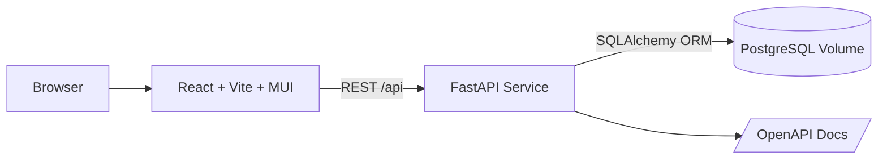
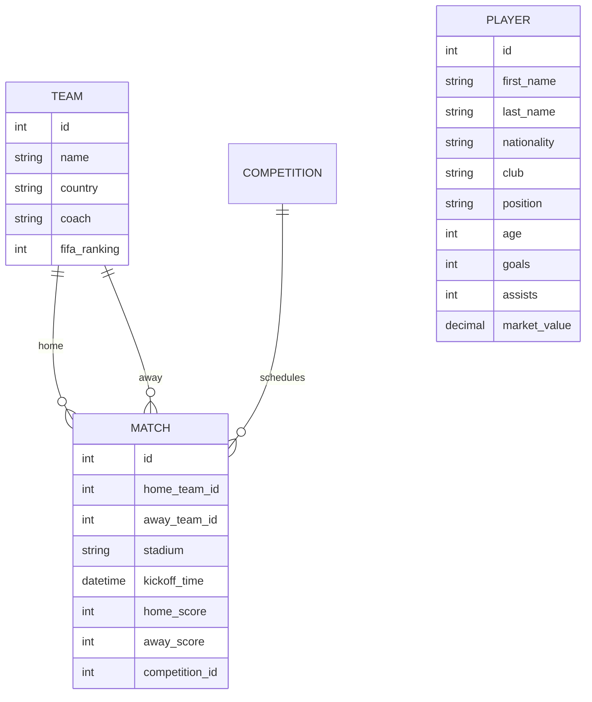

# GoalHub Architecture

```mermaid
flowchart LR
  Browser --> Frontend[React + Vite + MUI]
  Frontend -->|REST /api| Backend[FastAPI Service]
  Backend -->|SQLAlchemy ORM| Postgres[(PostgreSQL Volume)]
  Backend --> OpenAPI[/OpenAPI Docs/]
```

```mermaid
erDiagram
  TEAM ||--o{ MATCH : home
  TEAM ||--o{ MATCH : away
  COMPETITION ||--o{ MATCH : schedules
  PLAYER {
    int id
    string first_name
    string last_name
    string nationality
    string club
    string position
    int age
    int goals
    int assists
    decimal market_value
  }
  TEAM {
    int id
    string name
    string country
    string coach
    int fifa_ranking
  }
  MATCH {
    int id
    int home_team_id
    int away_team_id
    string stadium
    datetime kickoff_time
    int home_score
    int away_score
    int competition_id
  }
```
